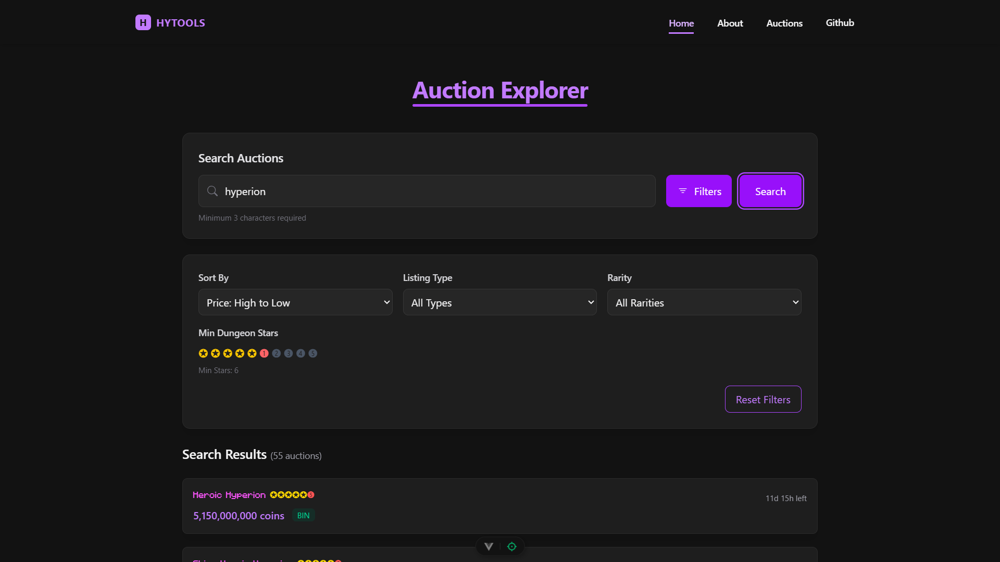
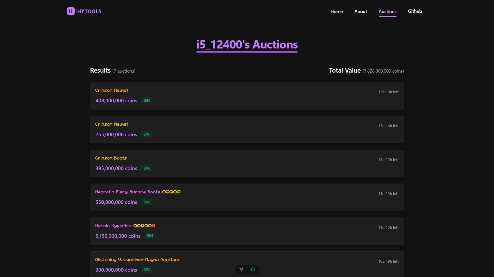
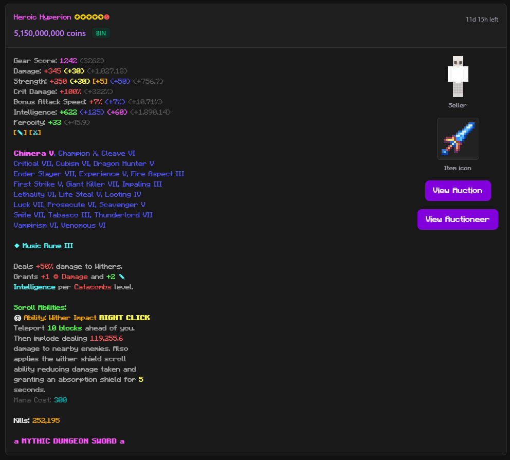

# HyTools

HyTools is a lightweight full-stack utility for Hypixel Skyblock, built with Express and Vue. It allows users to search for auctions with advanced filters like dungeon stars, rarity, and BIN/AUCTION type, as well as check a player's active auctions.

## Preview





## Features

- Search for auctions with advanced filters (stars, rarity, BIN/AH, etc.)
- Look up active auctions for any user (/auctions/<minecraft username>)
- 3 minute caching with parsing and validation for auctions
- Fast and easy-to-use interface

## Tech Stack

- **Frontend:** Vue.js
- **Backend:** Express.js
- **Data:** Hypixel API

## Installation

1. Clone the repo:

   ```sh
   git clone https://github.com/unloopedmido/hytools.git
   cd hytools
   ```

2. Install dependencies:

   ```sh
   cd client && npm install
   cd ../server && npm install
   ```

3. Run the development servers:

   ```sh
   npm run dev
   ```

## License

This project is licensed under the [MIT License](LICENSE).

---

Made by [Looped](https://github.com/unloopedmido) ❤️
